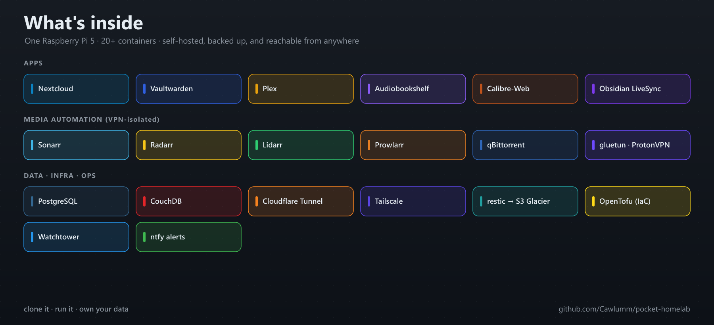

<p align="center">
  
</p>

<h1 align="center">Pocket Homelab</h1>

<p align="center">
  <b>A complete, self-hosted homelab on a single Raspberry Pi 5.</b><br/>
  Dockerized services · <b>zero open ports</b> · tested offsite backups · infrastructure-as-code.<br/>
  <i>Clone it, run one script, and own your data.</i>
</p>

<p align="center">
  <a href="https://github.com/Cawlumm/pocket-homelab/actions/workflows/ci.yml"></a>
  <a href="LICENSE"></a>
  
  
  
  
  <a href="https://github.com/Cawlumm/pocket-homelab/stargazers"></a>
</p>

<p align="center">
  <b><a href="#quick-start-5-minutes">Quick start</a> · <a href="#set-it-up-with-an-ai-agent">AI setup</a> · <a href="docs/architecture.md">Architecture</a> · <a href="docs/backups-and-dr.md">Backups</a> · <a href="docs/security.md">Security</a></b>
</p>

> If this helps you, **star it** — it's how other Pi homelabbers find it.

---

## Why Pocket Homelab?

Most homelab repos are a pile of `docker-compose.yml` files with no explanation. This one is built to
be **run by anyone** and **learned from** — every choice is documented, the whole thing is secret-safe,
and it sets itself up.

- **Zero open ports.** Public access via Cloudflare Tunnel — nothing to portscan, no port-forwarding, free TLS + WAF.
- **One-command setup.** `./bootstrap.sh` creates everything and **auto-generates your secrets**.
- **Agent-installable.** Point Claude Code / Cursor at it and say *"set up my homelab"* → [AGENTS.md](AGENTS.md).
- **Backups that actually restore.** Two-tier restic → S3 Glacier, defined in OpenTofu, **restore-tested to a bit-identical `diff`**.
- **It tells you when it breaks.** ntfy push alerts + systemd watchdogs (backup staleness, container health, VPN leak).
- **VPN killswitch by construction.** Downloaders share gluetun's netns — if the VPN drops, they go dark. No leaks.
- **Actually documented.** Architecture, security model, backup/DR, and real war stories — not just commands.
- **Runs on a 4 GB Pi.** Sips a few watts. No Kubernetes, no cloud bill (except a couple bucks of Glacier).

<p align="center"></p>

## Table of contents

- [Quick start](#quick-start-5-minutes)
- [Set it up with an AI agent](#set-it-up-with-an-ai-agent)
- [What's inside](#stacks)
- [Skills demonstrated](#skills-demonstrated)
- [Documentation](#documentation)
- [Add your own service](#add-your-own-service)
- [Roadmap](#roadmap) · [Contributing](#contributing) · [License](#license)

## Quick start (5 minutes)

```bash
# on a fresh Raspberry Pi 5 (Ubuntu) with Docker installed:
git clone https://github.com/Cawlumm/pocket-homelab.git ~/docker/stacks
cd ~/docker/stacks

./bootstrap.sh          # network + volumes + .env files, AUTO-GENERATES internal secrets
# fill the 1–2 external secrets it prints (ProtonVPN key, your domain), then:
./scripts/verify.sh     # preflight: host ready + configured + compose valid
make up                 # start everything (DB first) + watchtower
```

`make help` lists every target. **Nothing is exposed to the internet** until you set up the tunnel —
full walkthrough (Cloudflare Tunnel, Tailscale, backups) in **[docs/getting-started.md](docs/getting-started.md)**.

### Pick only the stacks you want

Don't want the whole thing? Pass the stacks you want to `bootstrap.sh` (dependencies are added
automatically — e.g. `nextcloud` pulls in `postgres`). Your choice is saved to `.enabled-stacks`, and
`make up` / `verify` use it.

```bash
./bootstrap.sh nextcloud vaultwarden          # just cloud + passwords
STACKS="media books arr" ./bootstrap.sh       # just the media stack
./bootstrap.sh                                 # everything (default)
make up                                         # starts exactly your selection
make up STACKS="vaultwarden"                    # one-off override
```

Handy combos:

| Goal | Command |
|------|---------|
| Just a password manager | `./bootstrap.sh vaultwarden` |
| Personal cloud (files + notes) | `./bootstrap.sh nextcloud vaultwarden obsidian-livesync` |
| Media server | `./bootstrap.sh media books arr` |
| Everything | `./bootstrap.sh` |

## Set it up with an AI agent

Point **Claude Code / Cursor / Aider** at the repo and say *"set up my homelab."* The agent playbook —
target path, exactly which secrets to ask you for, the procedure, and hard safety guardrails — lives in
**[AGENTS.md](AGENTS.md)** (+ `CLAUDE.md`). The agent runs `bootstrap.sh` (which generates internal
secrets), asks you only for the external ones, then `verify` → `up`. It won't commit secrets or expose
anything before the tunnel is configured.

## Stacks

| Stack | Containers | Local port | Example public URL |
|-------|-----------|-----------|--------------------|
| `nextcloud` | nextcloud + valkey (redis) | 8081 | nextcloud.example.com |
| `vaultwarden` | vaultwarden | 8084 | vault.example.com |
| `obsidian-livesync` | couchdb | 5984 | livesync.example.com |
| `media` | plex (host net) + audiobookshelf | 32400 / 8095 | audiobook.example.com |
| `books` | calibre + calibre-web | 8091 / 8092 | books.example.com |
| `arr` | gluetun (ProtonVPN) + qbittorrent + radarr/sonarr/lidarr/prowlarr + port-sync | via gluetun | radarr.example.com … |
| `postgres` | postgres 15 (shared) | 5432 (internal) | — |
| top-level | watchtower (auto-updates) | — | — |

All `arr` downloaders share **gluetun's** network namespace — VPN drops = they go offline (fail-closed killswitch).

## Skills demonstrated

> For engineers evaluating this as a portfolio piece.

| Area | What's in this repo |
|------|---------------------|
| **Containerization** | 8 Compose stacks, healthchecks, shared network, VPN network-namespace isolation |
| **Networking & security** | Cloudflare Tunnel (0 open ports), Tailscale, `ufw` default-deny, Cloudflare Access, VPN killswitch + leak detection |
| **Backup & DR** | restic → S3 Glacier IR + `aws s3 sync` → Deep Archive, retention, **tested restore drill** |
| **Infrastructure as code** | OpenTofu: versioned/encrypted S3 buckets, lifecycle rules, least-privilege IAM, budget alarm, CloudWatch dashboard |
| **Observability** | ntfy push alerts, systemd-timer watchdogs (backup staleness, container health, VPN leak) |
| **Ops discipline** | version-controlled host config, automated updates, documented incident fixes, CI secret-scanning |

## Documentation

| Doc | What it covers |
|-----|----------------|
| **[AGENTS.md](AGENTS.md)** | Set it up with an AI agent — playbook + guardrails |
| **[Architecture](docs/architecture.md)** | The three network planes, request lifecycle, design trade-offs |
| **[Getting started](docs/getting-started.md)** | Clone → running, step by step |
| **[Host tuning](docs/host-tuning.md)** | Swap, sysctl, log caps, ufw, and SMB (LAN vs Tailscale) |
| **[Backups & DR](docs/backups-and-dr.md)** | Two-tier restic/Glacier design + restore drill + cost |
| **[Security](docs/security.md)** | Zero-open-ports, VPN killswitch, least-priv IAM, secrets hygiene, threat model |
| **[Lessons learned](docs/lessons-learned.md)** | Real incidents and the fixes worth stealing |

## Add your own service

Extending it is one folder. Copy [`_template/`](_template/), rename it, edit the compose + `.env.example`,
attach to the `backend` network if it needs the DB, and add one ingress line to your Cloudflare Tunnel:

```bash
cp -r _template myapp && cd myapp
$EDITOR docker-compose.yml .env.example
cp .env.example .env && $EDITOR .env
docker compose up -d
```

## Roadmap

- [ ] Optional Grafana + Prometheus monitoring stack
- [ ] `restic` restore-drill as a scheduled, self-verifying timer
- [ ] Second-node guide (Proxmox / a second Pi) over the same Tailscale mesh
- [ ] Optional Immich (photos) and Paperless-ngx (documents) stacks
- [ ] One-shot Cloudflare Tunnel config generator

Ideas welcome — open an issue.

## Contributing

PRs and issues welcome — see **[CONTRIBUTING.md](CONTRIBUTING.md)**. Good first contributions: a new
stack under the `_template/` pattern, doc fixes, or hardening suggestions. CI runs a **gitleaks** secret
scan + compose validation on every PR, so you can't accidentally leak a secret.

## Star history

<a href="https://star-history.com/#Cawlumm/pocket-homelab&Date">
  
</a>

## A note on safety

This mirrors my personal setup with identifiers redacted (domain, IPs, cloud account, notification
topics). **No secrets are committed** — every stack ships a `.env.example`, real `.env` files/keys/state
are gitignored, and a gitleaks scan runs in CI. Replace the `example.com` / `youruser` / `CHANGE_ME`
placeholders with your own.

## License

[MIT](LICENSE) — use it, fork it, learn from it. Attribution appreciated, not required.
