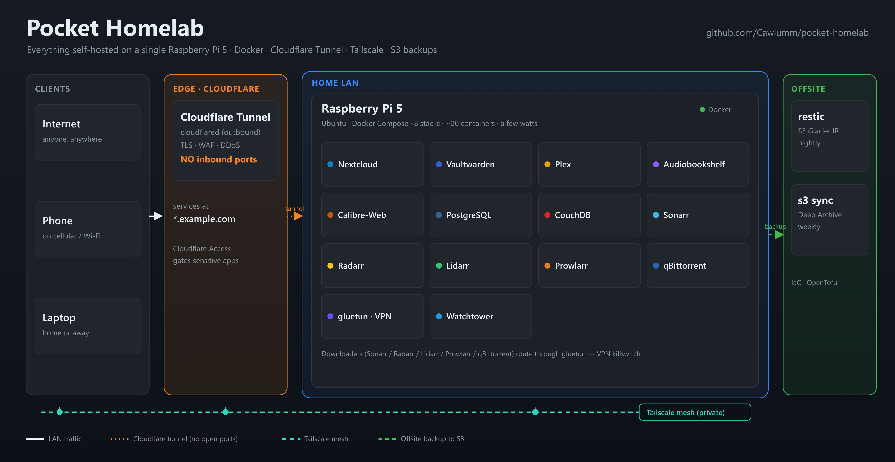

# Architecture



A single Raspberry Pi 5 (4 GB, Ubuntu 25.04) running eight Docker Compose stacks
that serve real workloads to the public internet — **without opening a single
inbound port on the router**. Public traffic arrives through a Cloudflare
Tunnel; admin access rides a Tailscale mesh; backups fan out to two tiers of
AWS S3 Glacier; and a handful of systemd timers push notifications when
anything drifts.

This document explains *how the pieces fit and why they were chosen that way*.
It is meant to be read top-to-bottom by a beginner, and skimmed by an engineer
evaluating the repo. Every hostname here is a placeholder (`example.com`,
`youruser`); swap in your own.

> **Scope.** This repo is the Pi stack. If you have a second machine, you can
> *extend* it — e.g. a Proxmox host running VMs like Home Assistant on separate
> hardware — but that is out of scope here. Everything below runs on one Pi.

---

## The three network planes

Traffic reaches this box through exactly three doors. Understanding which door
a request uses is the key to the whole design.

```
                          ┌─────────────────────────────────────────┐
                          │              INTERNET                     │
                          └─────────────────────────────────────────┘
                                │                        │
              PUBLIC PLANE      │                        │   PRIVATE PLANE
          (Cloudflare Tunnel)   │                        │   (Tailscale mesh)
                                │                        │
                     nextcloud.example.com          admin laptop / phone
                     vault.example.com                (WireGuard, 100.x.y.z)
                     audiobook.example.com                  │
                                │                           │  SSH, *arr UIs,
                    ┌───────────▼──────────┐                │  Portainer, etc.
                    │  Cloudflare edge      │               │
                    │  (TLS terminates,     │               │
                    │   WAF, DDoS)          │               │
                    └───────────┬──────────┘                │
                        outbound-only                        │
                        QUIC tunnel                          │
                                │                            │
   ═══════════════════ Raspberry Pi 5 (Ubuntu 25.04) ═══════▼══════════════════
   │                                                                           │
   │   ┌──────────────┐   resolves *.example.com → localhost:<port>            │
   │   │ cloudflared  │──────────────┐                                         │
   │   └──────────────┘              │                                         │
   │                                 ▼                                         │
   │   ┌───────────────────────────────────────────────────────────────────┐ │
   │   │  Docker  —  external network `backend`                             │ │
   │   │                                                                    │ │
   │   │  nextcloud   postgres   vaultwarden   media    books    arr        │ │
   │   │  obsidian-livesync                              watchtower          │ │
   │   └───────────────────────────────────────────────────────────────────┘ │
   │                                                                           │
   │        LAN PLANE: 192.168.1.0/24 — printers, Plex DLNA, direct SSH        │
   ═════════════════════════════════════════════════════════════════════════════
```

**Public plane — Cloudflare Tunnel.** The `cloudflared` daemon dials *out* to
Cloudflare and holds a persistent QUIC connection open. Cloudflare's edge
receives `https://<svc>.example.com`, terminates TLS, and pushes the request
back down that existing connection to `cloudflared`, which proxies it to
`localhost:<port>`. The router has **zero inbound ports open**. There is no
`A` record pointing at your home IP, no port-forward, nothing to portscan.

**Private plane — Tailscale.** Admin surfaces (SSH, the `*arr` web UIs,
database ports, anything you don't want on the public internet) are reached
over a Tailscale mesh — a WireGuard network where every device gets a stable
`100.x.y.z` address. From a phone on cellular or a laptop in a café, you're one
`ssh youruser@pi` away, encrypted end-to-end, still with no open router ports.

**LAN plane — plain old `192.168.1.0/24`.** Some things are intentionally
local: Plex runs on the host network for fast DLNA/local streaming and client
discovery; a printer; direct SSH when you're home. Nothing here is exposed
outward.

---

## Request lifecycle: a phone hits `nextcloud.example.com`

Follow a single request from a phone on mobile data to the container, and note
that **no inbound port is ever opened**:

1. **DNS.** The phone resolves `nextcloud.example.com`. The record is a
   Cloudflare-proxied `CNAME` pointing at the tunnel, so it returns a
   *Cloudflare* IP — never your home address.
2. **TLS to the edge.** The phone opens `https://` to Cloudflare's nearest
   edge PoP. TLS terminates *there*. Cloudflare's WAF and DDoS protection see
   the request first.
3. **Down the tunnel.** Cloudflare looks up which tunnel serves that hostname
   and sends the request down the **already-open, outbound-initiated** QUIC
   connection that `cloudflared` on the Pi established at boot. Your firewall
   sees only an outbound connection it trusts — there is nothing inbound to
   allow.
4. **Ingress rules.** `cloudflared` consults its ingress map
   (`nextcloud.example.com → http://localhost:8081`) and proxies the request
   to that local port.
5. **Into Docker.** That port is published by the `nextcloud` container. It
   handles the request, taking file locks via **Valkey** (a Redis-compatible
   server) and reading/writing app data in **Postgres** over the shared
   `backend` network.
6. **Back out.** The response retraces the path: container → `cloudflared` →
   Cloudflare edge → phone. The user sees a normal fast HTTPS site.

The mental model: **you are not hosting a server that the internet connects
*to*. You are running a client that stays connected *out* to Cloudflare, and
Cloudflare hands it work.**

---

## The stacks

Each stack is its own Compose project in its own directory. They share one
external Docker network, `backend`, and one convention: **volumes live outside
git** at `~/docker/volumes/<stack>/`, so secrets and data never get committed.

| Stack | What it runs | Ingress | Notes |
|---|---|---|---|
| `nextcloud` | Nextcloud + **Valkey** (Redis-compatible) | Public (Tunnel) | Files/calendar/contacts. Valkey provides file locking; app data in shared Postgres. |
| `postgres` | One PostgreSQL server | none (internal) | Shared DB for Nextcloud and other stacks. Reached over `backend`. |
| `vaultwarden` | Vaultwarden (Bitwarden-compatible) | Public (Tunnel) | Password manager. **SQLite** on disk — small, single-writer, no DB dependency. |
| `media` | **Plex** (host network) + Audiobookshelf | Public + LAN | Plex on host net for DLNA/discovery/direct play; Audiobookshelf behind the Tunnel. |
| `books` | Calibre + Calibre-Web | Public (Tunnel) | Calibre manages the library; Calibre-Web serves the reading UI. |
| `arr` | gluetun (ProtonVPN) + qBittorrent + Sonarr/Radarr/Lidarr/Prowlarr + port-sync sidecar | Private (Tailscale) | See below — the most intricate stack. All downloaders tunnel through gluetun. |
| `obsidian-livesync` | CouchDB | Public (Tunnel) | Sync backend for the Obsidian LiveSync plugin (phone ⇄ vault). |
| `watchtower` | Watchtower | none | Top-level, not per-stack. Watches all containers and auto-pulls new images. |

### The `arr` stack in detail

This is the stack worth studying. It runs a media-acquisition pipeline where
**every byte of downloader traffic is forced through a VPN, and the connection
hard-fails if the VPN drops.**

```
   ┌──────────────────────────────────────────────────────────┐
   │  gluetun  (ProtonVPN via WireGuard, killswitch on)         │
   │  ── owns the network namespace ──                          │
   │                                                            │
   │   qBittorrent      Sonarr   Radarr   Lidarr   Prowlarr     │
   │   (network_mode: service:gluetun for the downloaders)      │
   └──────────────────────────────────────────────────────────┘
                    ▲
                    │  port-sync sidecar keeps qBittorrent's listen
                    │  port == ProtonVPN's forwarded port
```

- **`network_mode: service:gluetun`** means the downloaders have *no network
  stack of their own* — they share gluetun's. Their only route to the internet
  is through the VPN tunnel. If gluetun's VPN connection drops, gluetun's
  killswitch blocks all traffic, and because the containers *are* gluetun's
  network, **they instantly lose connectivity too.** There is no leak window,
  no misconfiguration that accidentally sends a torrent over your real IP.
- **The port-sync sidecar** solves a subtlety: ProtonVPN hands out a
  *forwarded port* for inbound peer connections, and it can change. The sidecar
  watches gluetun for the current forwarded port and pushes it into
  qBittorrent's settings via its API, keeping your torrent client actually
  reachable by peers without manual fiddling.
- The `*arr` web UIs are **not** on the public plane — you reach them over
  Tailscale.

---

## Design decisions & trade-offs

Opinionated choices, and the honest cost of each.

### Cloudflare Tunnel over port-forwarding

**Decision.** No inbound ports. `cloudflared` dials out; Cloudflare proxies in.

**Why.** Port-forwarding puts your home IP on the public internet and asks you
to secure everything perfectly forever. A tunnel inverts the trust: the only
connection is one *you* initiated outbound, so there is no attack surface to
portscan, no dynamic-DNS dance, and the edge gives you free TLS, WAF, and DDoS
absorption. Your real IP never appears in DNS.

**Trade-off.** You depend on Cloudflare (a third party) being up and trusting
their edge with your TLS termination. For a homelab, that's a very good trade;
if you need zero third-party trust, this isn't for you. Large media streams
over the Tunnel can also bump Cloudflare's usage norms — which is exactly why
Plex streams on the LAN/host network instead.

### One shared Postgres instead of a DB per app

**Decision.** A single `postgres` stack; apps connect to it over `backend`.

**Why.** On a 4 GB Pi, RAM is the scarce resource. Every additional Postgres
instance means another shared-buffers allocation, another connection pool,
another thing to back up and tune. One well-configured server with a database
per app is dramatically lighter and gives you a single place to manage backups
and performance.

**Trade-off.** It's a shared fate: a bad migration or a runaway query can
affect every app, and you can't upgrade Postgres for one app independently.
Note the deliberate exception — **Vaultwarden uses SQLite**, not shared
Postgres. A password manager is small, single-writer, and security-critical;
keeping it on a self-contained file removes a network dependency and shrinks
its blast radius.

### gluetun namespace sharing for the killswitch

**Decision.** Downloaders run with `network_mode: service:gluetun`.

**Why.** A VPN "killswitch" implemented with firewall rules can be
misconfigured and leak. Sharing gluetun's network namespace makes leaks
*structurally impossible*: the download containers have no independent route to
the internet at all. If the VPN is down, they are simply offline. Correctness
by construction beats correctness by configuration.

**Trade-off.** Coupling. If gluetun restarts, the dependent containers lose
their network and usually need to restart too (handled with `depends_on` and
restart policies). You also can't give one downloader a different network path
without breaking the model.

### Docker Compose over Kubernetes on a Pi

**Decision.** Plain Docker Compose, one project per stack. No orchestrator.

**Why.** This is one node. Kubernetes (even k3s) spends real CPU and RAM on a
control plane, etcd, and reconciliation loops to solve problems — scheduling
across many nodes, self-healing a fleet — that a single Pi does not have. A
Compose file *is* the deployment: readable, greppable, diffable, and trivially
reproducible by anyone cloning the repo. That readability is a feature for a
teaching/portfolio repo.

**Trade-off.** No automatic rescheduling, no rolling deploys, no horizontal
scaling. If the Pi dies, the services are down until you restore. For a
single-host homelab that's an acceptable — even correct — trade.

### restic + a two-tier Glacier strategy

**Decision.** Nightly **restic → S3 Glacier Instant Retrieval**; weekly
`aws s3 sync` → **Glacier Deep Archive**. Infra defined in **OpenTofu**.

**Why.** The two tools do different jobs. **restic** gives deduplicated,
encrypted, incremental snapshots with easy point-in-time restore — the backup
you actually reach for when you fat-finger a delete. **Glacier Instant
Retrieval** keeps those recent snapshots cheap but instantly restorable.
Separately, a weekly full `aws s3 sync` to **Glacier Deep Archive** is the
cold, cheap, worst-case "the house burned down" copy — pennies per GB, hours to
restore, and that's fine because it's the last resort. Two tiers because
"cheap + slow" and "recent + instant" are genuinely different needs.
**OpenTofu** (open-source Terraform) defines the buckets, lifecycle rules, and
IAM so the whole backup target is reproducible and reviewable, not clicked
together in a console.

**Trade-off.** More moving parts than a single backup job, and Deep Archive
restores are slow and have retrieval costs. That's the point — you accept slow
restore on the tier you hope to never use, in exchange for it costing almost
nothing to keep.

---

## Observability & self-healing

No dashboards to babysit. The Pi tells *you* when something is wrong, via
**ntfy** push notifications (they land on your phone) driven by
**systemd-timer watchdogs**:

- **`homelab-updates`** — Watchtower reports when it pulls and restarts a
  container to a new image.
- **`homelab-backups`** — the restic and `aws s3 sync` jobs report success, and
  a watchdog alerts on **backup staleness** (no successful backup in N hours).
- **`homelab-health`** — timers check **container health** (anything unhealthy
  or exited) and run a **VPN leak check** (confirm the downloaders' egress IP
  is the VPN's, never your real IP).

The philosophy: silence means healthy; a push means act. On a headless box you
never log into for fun, that's the right signal-to-noise ratio.

---

## Extending it

- **A second machine?** Put heavier or always-on-different-hardware workloads
  (a Proxmox host with a Home Assistant VM, say) on their own box and reach
  them over the same Tailscale mesh. The Pi stack here doesn't need to know.
- **A new public service?** Add a stack, attach it to `backend`, add one
  ingress line to the `cloudflared` config, done — no router, no DNS scramble.
- **A new private service?** Skip the Tunnel entirely; reach it over Tailscale.

Clone it, swap the placeholders for your own domain and topics, and you have a
secure, backed-up, self-notifying homelab on a board that draws a few watts.
